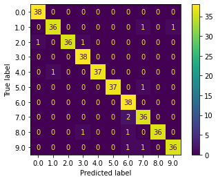
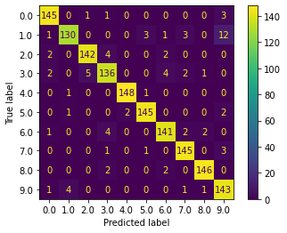
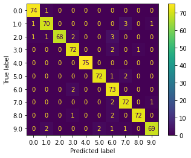
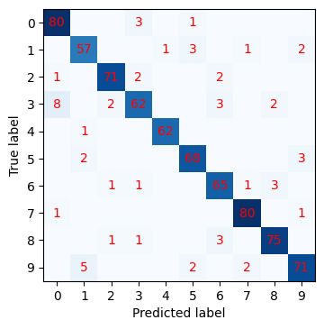
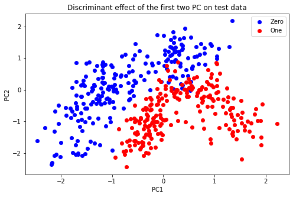
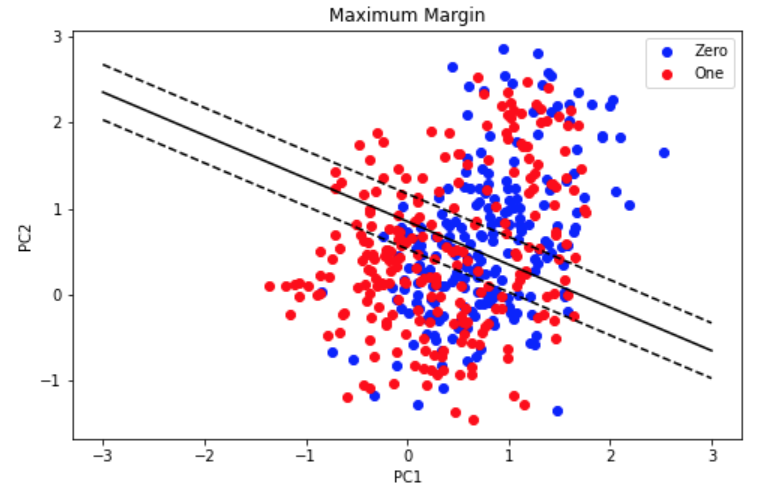
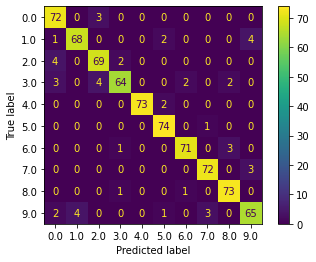
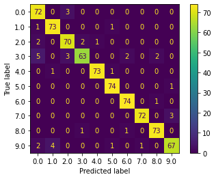
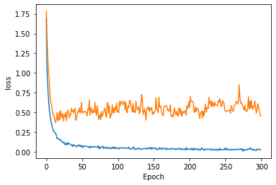
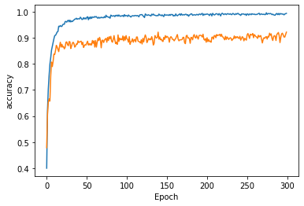

# Dataset {#dataset .unnumbered}

We provide our model with the Free Spoken Digit Dataset (FSDD), a very popular and common dataset for speech classification. The dataset provide 3000 recordings in english pronunciation, with 50 repetitions for each digit (0 - 9) for all the 6 speaker.

The audio files are already trimmed and organized in a very convenient way, thus the pre-processing of the dataset -once imported- was not needed.

The repository also includes some utility functions for training/testing splitting, but we preferred to use `sklearn` native functionality, where we set up the testing set as 25% of the overall dataset.

# Features {#features .unnumbered}

As previously anticipated, we computed MFCC for feeding the SVM classifier. After some trials and errors, we set up the number of MFCC as 13, without evaluating the very first coefficient, that retains no useful information [@mfcc] but the average spectral power. Regarding the DNN network,we decided to use a Sequential model, we decided to use it instead of the Functional model because we didn't need a model with multiple inputs or outputs and neither to create more models to share layers. Our architecture is made of three input layers with respectively 256, 128 and 128 nodes, that actually seems a bit large number considering the amount of data in the dataset, but actually worked fine. All layers are Dense layers, also the output one with 10 nodes. For the activation function of each layers we decided to use the Rectified Linear Activation(ReLU) on the input layers, who is proven to work really well, and the Softmax for the output layer.

# Classification {#classification .unnumbered}

As requested by the SVM [@scalingSVM], the features were scaled accordingly to the training stats before feeding the classifier, leading to zero mean and unitary variance. We then leave SVM parameters as the standard `sklearn` ones, namely with regularization parameter `C` set to 1, *Radial basis function* kernel, *kernel coefficient* `gamma` set to `scale`. In particular, within `rbf` kernel:

-   the `gamma` parameter defines how far the influence of a single training example reaches, with low values meaning 'far' and high values meaning 'close'

-   the `C` parameter trades off correct classification of training examples against maximization of the decision function's margin. For larger values of `C`, a smaller margin will be accepted if the decision function is better at classifying all training points correctly. A lower `C` will encourage a larger margin, therefore a simpler decision function, at the cost of training accuracy. In other words, the `C` parameter behaves as a regularization parameter in the SVM.

# Results {#results .unnumbered}

For evaluating classifiers performances, we plotted their relative *confusion matrix*. Regarding SVM, we computed the *mean absolute error* as an indicator for its accuracy in the prediction for training and testing set and inspect an eventual overfitting. Since `mae` prediction values are comparable for both training and testing set, we end up with non-overfit status. For the DNN, we used 500 epochs to train our model, we tried to give the model the largest amount possible of epochs to increase accuracy evaluation, but keeping it safe from overfitting; to prevent overfitting, we decided to include also 2 dropout layers in between the input layers; also, the batch size for testing is 128, not so high in comparison with the amount of data put in the network, so we've tried to keep the model safe from memory overworking. Final results are pretty convincent, obtaining a high grade of accuracy, around 92%.

{#Fig:Data2 width=".6\\linewidth"}

{#Fig:Data2 width=".6\\linewidth"}

{#Fig:Data2 width=".6\\linewidth"}

{#Fig:Data2 width=".6\\linewidth"}

{#Fig:Data2 width=".6\\linewidth"}

{#Fig:Data2 width=".6\\linewidth"}

# Re-tuning SVM parameters {#re-tuning-svm-parameters .unnumbered}

The classification results were already quite good, but we tried to further optimize SVM parameters for enhancing the predictions. We used *grid search cross validation* for searching through a set of SVM main parameters, and thus we ended up with new optimal values for both `gamma` and `c` parameters different to the default ones, namely we end up with $\texttt{gamma} = 0.01$ and $\texttt{c} = 10$. Even if the final, optimized *confusion matrix* was not so different from the previous results, indeed we limited the `mae` of classifier's predictions.

# Principal Component Analysis {#principal-component-analysis .unnumbered}

Finally, some plots! Since with SVM we worked in 13-dimensional feature space, it was quite hard up to this point to actually \"see\" SVM classification and MFCC's weight in the prediction. Thanks to *Principal Component Analysis*, we end up with an approximation in two dimensions of the feature space. Indeed, PCA is an analysis technique which 'drains' from the N-dimensional feature space a set of N variables, the *n-th PCs*, which are computed as linear combination of the features in the N space by fitting the lines which best fit the feature set. We've computed the *scree plot* in order to look at the meaningfulness of the first two *PCA* components in describing our feature space. Lastly, we look at the 'discriminant power' of the MFCC coefficients in building up the fist *Principal Component*, thus the*first, ninth, eigth, third, fifth and twelwe-th* mfcc were the most important in discerning the digit.

   Features      mfcc1       mfcc9       mfcc8       mfcc3       mfcc5      mfcc12
----------- ----------- ----------- ----------- ----------- ----------- -----------
    Values     -0.413911   -0.413616   0.395009    0.375861    0.368578    -0.318639
     mfcc2      mfcc11       mfcc7       mfcc6      mfcc10      mfcc13       mfcc4
   -0.188144   0.161578    -0.144557   -0.142695   -0.092862   -0.077040   0.074797

  : Values of each features(PC1)

{width=".7\\linewidth"}

{width=".7\\linewidth"}

# Conclusions {#conclusions .unnumbered}

We implemented two very popular algorithms of machine learning, namely Support Vector Machine and Deep Neural Network, in order to predict which digit is pronounced in a short audio excerpt. The results are encouraging for both the models, with accuracy rates that overcome the 90%, thus confirming the popularity in speech recognition tasks of both the models and the features used along this project.

{#Fig:Data4 width=".7\\linewidth"}

{#Fig:Data4 width=".7\\linewidth"}

{#Fig:Data4 width=".7\\linewidth"}

{#Fig:Data4 width=".7\\linewidth"}
